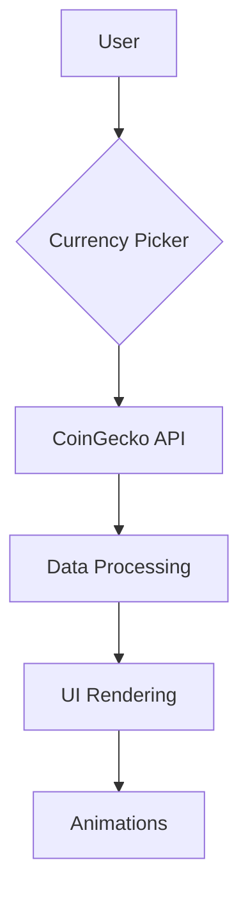

# 💰 Crypto Tracker - Flutter
```
```markdown
# 💰 Crypto Tracker - Flutter


<div align="center">
  
  
</div>

## ✨ Key Features
| Feature | Description |
|---------|-------------|
| **Real-time Prices** | BTC, ETH, LTC, XRP, BNB with 20+ fiat currencies |
| **Platform-Adaptive** | Cupertino (iOS) & Material (Android) widgets |
| **Visual Feedback** | Shimmer loading + animated transitions |
| **Error Resilient** | Auto-retry + connectivity checks |

## 🛠️ Tech Stack
### Core Framework


### Backend Services


### UI Enhancements


## 🚀 Installation
```bash
# Clone with SSH
git clone git@github.com:your-username/crypto-tracker.git

# Or with HTTPS
git clone https://github.com/your-username/crypto-tracker.git

# Install dependencies
flutter pub get

# Run the app
flutter run
```

## 📊 Performance Metrics
```python
{
  "api_response_time": "~400ms",
  "frame_rate": "60fps", 
  "app_size": "12MB (release)",
  "supported_currencies": 20+
}
```

## 🖥️ Screenshots
<div align="center">
  
</div>

## 🏗️ Architecture


## 🌟 Roadmap
- [x] Real-time price display
- [x] Multi-currency support
- [ ] Price change history graphs
- [ ] Portfolio tracking
- [ ] Push notifications

## 🤝 Contributing
1. Fork the repository
2. Create your feature branch (`git checkout -b feature/amazing-feature`)
3. Commit changes (`git commit -m 'Add amazing feature'`)
4. Push to branch (`git push origin feature/amazing-feature`)
5. Open a Pull Request

---
<div align="center">
  <a href="https://github.com/SoftTac/crypto-tracker/stargazers">
    
  </a>
  <a href="https://github.com/SoftTac/crypto-tracker/issues">
    
  </a>
</div>

> "Cryptocurrency tracking made beautiful and accessible."  
> *Developed with ❤️ by [Ahmad Khalil Khattak]*
```
